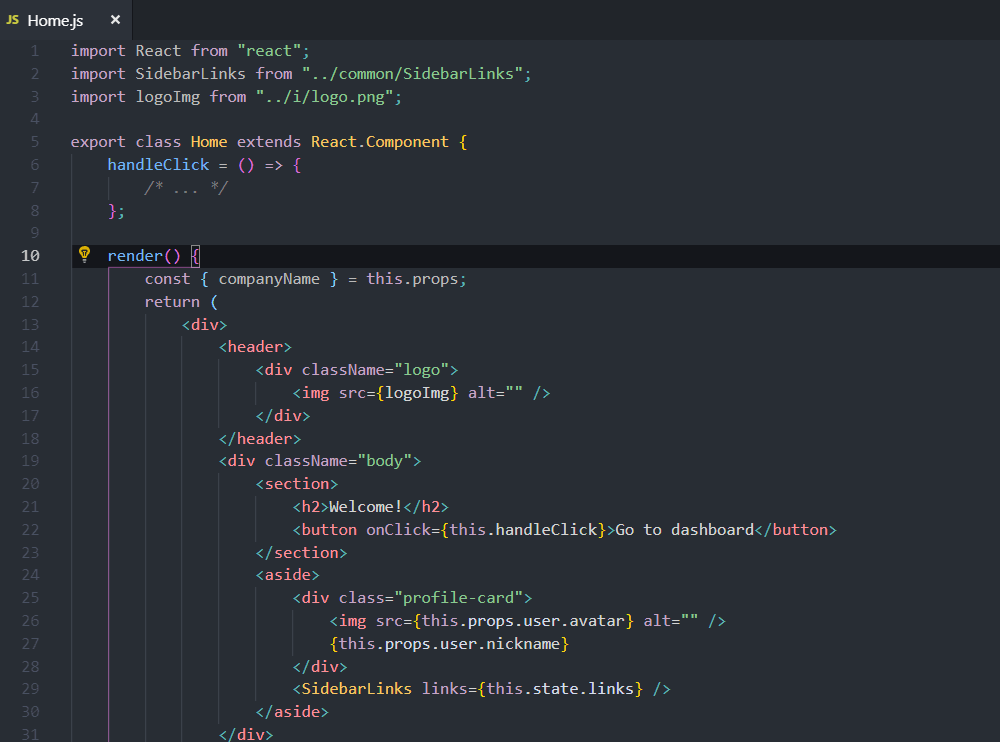

# React Refactor

This simple extension provides JSX refactor code actions for React developers.

## Features

- Extract JSX code parts to a new class or functionnal component
- Supports TypeScript and TSX
- Works with classes, functions and arrow functions
- Handles key attribute and function bindings
- Compatible with React Hooks API

## Preview

## Change Log

Refer to [CHANGELOG](CHANGELOG.md)

## Help to debug

w

### Code Action doesn't appear when select JSX code

If something doesn't work don't panic. Probably you use a language feature that is not recognized by the parser within your module (file). Now you get back an error message about what's going on. Use the new Babel plugins setting to configure it for your needs. See: <https://babeljs.io/docs/en/babel-parser#plugins>.

If no luck please open an issue with

- smallest non-working code snippet to reproduce the issue
- the received error message

### Refactoring happens but results broken code

Please record an issue with the original code and the result after refactor executed.

## CI/CD

This extension uses GitHub Actions for automated building and publishing:

- **Build**: Automatically builds and tests on every push/PR
- **Publish**: Automatically publishes to VS Code Marketplace when version tags are pushed
- **Releases**: Creates GitHub releases with packaged extension for Eclipse Marketplace

### Quick Publish Guide

1. Update version in `package.json`
2. Commit and push changes
3. Create and push a version tag: `git tag v1.2.1 && git push origin v1.2.1`
4. CI/CD will automatically build and publish to marketplaces
